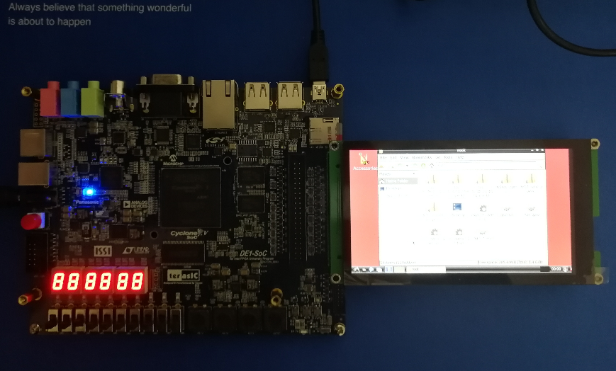

# Multi-Interface LCD
MI-LCD is a multiple interface (intel 8080, 3-wire SPI, DPI RGB )  5 inch TFT LCD capacitive touch screen module which is compatible with teraisc DE-series boards 

## Features
- 5 inch TFT LCD with 480(RGB)*854(line)
- capacitive touch screen with 5 points touch
- ili9806g and ft5216 chips
- similar to terasic MTL2 and LT24
- support DBI Tpye B display interface (Intel 8080 8-bits,9-bits,16-bits,18-bits,24-bits bus) 
- support DBI Tpye C display interface (3-wire SPI)
- support DPI display interface (RGB), 16/18/24-bit Pixel Format with SPI initialization
- support touch i2c inferface 
- teraisc DE-series boards 2x20 GPIO Pins
- Arduino Pins with Intel 8080 8-bits bus and touch i2c

## PCB layout

## Plans

- [x] DE1-SoC Linux framebuffer and touch Quartus projecct (854 dots * 480 line)
- [x] Linux framebuffer and touch driver for MI-LCD
- [x] Verilog SPI initialization code
- [ ] DE10-Nano Nios II with Intel 8080 8-bits bus
- [ ] DE10-Nano Nios II with SPI
- [ ] DE1-SoC Nios II with DPI interface (RGB)

## How to use

## MTL2 and LT24

- [MTL2](https://www.terasic.com.tw/cgi-bin/page/archive.pl?Language=English&CategoryNo=68&No=989)
- [LT24](https://www.terasic.com.tw/cgi-bin/page/archive.pl?Language=English&CategoryNo=65&No=892)
