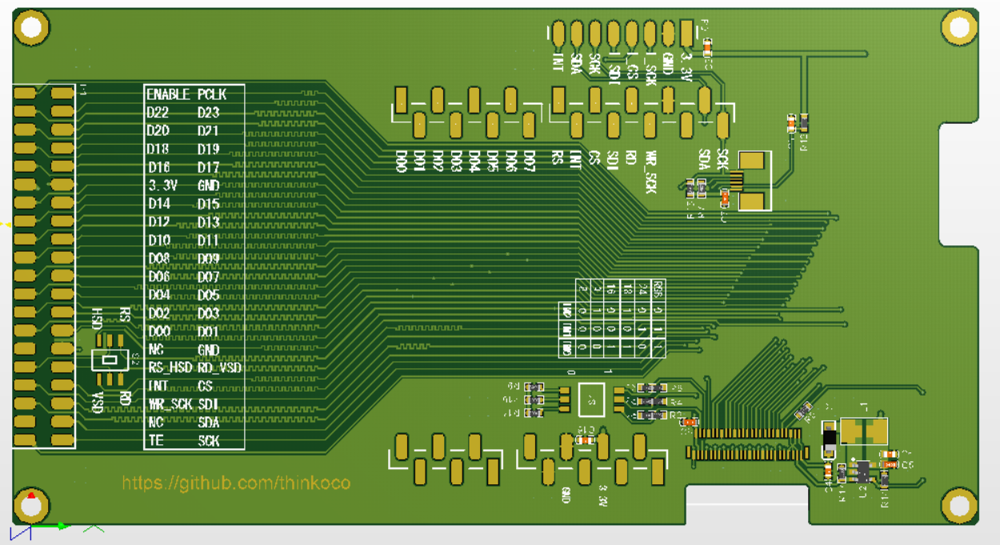

# Multi-Interface LCD
MI-LCD is a multiple interface: DBI Type B Parallel Interface (intel 8080), DBI Type C Serial Interface (3-wire SPI) and DPI Interface ( RGB) 5 inch TFT LCD capacitive touch screen module which is compatible with teraisc DE-series boards 

## Features
- 5 inch TFT LCD with 480(RGB)*854(line)
- capacitive touch screen with 5 points touch
- ili9806g and ft5x16 chips
- similar to terasic MTL2 and LT24 (two in one)
- support DBI Tpye B display interface (Intel 8080 8-bits,9-bits,16-bits,18-bits,24-bits bus) 
- support DBI Tpye C display interface (3-wire SPI)
- support DPI display interface (RGB), 16/18/24-bit Pixel Format with SPI initialization
- support touch i2c inferface 
- teraisc DE-series boards 2x20 GPIO Pins
- Arduino Pins with Intel 8080 8-bits bus and touch i2c

## Compatibility Table

|      Boards & Pins     |SPI 3wire |i80-8b |i80-9b |i80-16b |i80-18b |i80-24b |RGB-16b |RGB-18b |RGB-24b |
|:---------------------- |:--------:|:-----:|:-----:|:------:|:------:|:------:|:------:|:------:|:------:|
| DE10-Nano GPIO_0/1     |    `√`   |  `√`  |   √   |   √    |   √    |   `√`  |    √   |    √   |   `√`  |
| DE1-SoC GPIO_0/1       |     √    |   √   |   √   |   √    |   √    |    √   |    √   |    √   |   `√`  |
| DE0-Nano-SoC GPIO_0/1  |     √    |   √   |   √   |   √    |   √    |    √   |    √   |    √   |    √   |
| DE10-Standard GPIO     |     √    |   √   |   √   |   √    |   √    |    √   |    √   |    √   |    √   |
| DE0-Nano GPIO          |     √    |   √   |   √   |   √    |   √    |    √   |    √   |    √   |    √   |
| DE0-CV GPIO            |     ?    |   ?   |   ?   |   ?    |   ?    |    ?   |    ?   |    ?   |    ?   |
| DE0 GPIO_0/1           |     √    |   ?   |   ?   |   ?    |   ?    |    ?   |    ?   |    ?   |    ?   |
| DE1 GPIO_0/1           |     √    |   ?   |   ?   |   ?    |   ?    |    ?   |    ?   |    ?   |    ?   |
| DE2 GPIO_0/1           |     √    |   √   |   √   |   √    |   √    |    √   |    √   |    √   |    √   |
| DE2-70 GPIO_0/1        |     √    |   ?   |   ?   |   ?    |   ?    |    ?   |    ?   |    ?   |    ?   |
| DE10-Lite GPIO         |     ?    |   ?   |   ?   |   ?    |   ?    |    ?   |    ?   |    ?   |    ?   |
| DE2-115 GPIO           |     √    |   √   |   √   |   √    |   √    |    √   |    √   |    √   |    √   |
| DE2i-150 GPIO          |     ?    |   ?   |   ?   |   ?    |   ?    |    ?   |    ?   |    ?   |    ?   |
| C5G GPIO               |     √    |   √   |   √   |   √    |   √    |    √   |    √   |    √   |    √   |
| ADC-SoC GPIO           |     ?    |   ?   |   ?   |   ?    |   ?    |    ?   |    ?   |    ?   |    ?   |
| OpenVINO GPIO          |     ?    |   ?   |   ?   |   ?    |   ?    |    ?   |    ?   |    ?   |    ?   |
| C10EFP-LP GPIO         |     ?    |   ?   |   ?   |   ?    |   ?    |    ?   |    ?   |    ?   |    ?   |
| Terasic TR4 GPIO       |     ?    |   ?   |   ?   |   ?    |   ?    |    ?   |    ?   |    ?   |    ?   |
| Terasic DE3 GPIO       |     ?    |   ?   |   ?   |   ?    |   ?    |    ?   |    ?   |    ?   |    ?   |
| Terasic DE4 GPIO       |     ?    |   ?   |   ?   |   ?    |   ?    |    ?   |    ?   |    ?   |    ?   |
| DE10-Nano Arduino      |     √    |   √   |   ×   |   ×    |   ×    |    ×   |    ×   |    ×   |    ×   |
| DE0-Nano-SoC Arduino   |     √    |   √   |   ×   |   ×    |   ×    |    ×   |    ×   |    ×   |    ×   |
| DE10-Lite Arduino      |     √    |   √   |   ×   |   ×    |   ×    |    ×   |    ×   |    ×   |    ×   |
| ADC-SoC Arduino        |     ?    |   ?   |   ×   |   ×    |   ×    |    ×   |    ×   |    ×   |    ×   |
| OpenVINO Arduino       |     ?    |   ?   |   ×   |   ×    |   ×    |    ×   |    ×   |    ×   |    ×   |
| C10EFP-LP Arduino      |     ?    |   ?   |   ×   |   ×    |   ×    |    ×   |    ×   |    ×   |    ×   |

`√`: Pin compatible and had been tested

√ : Pin compatible, not tested

× : Pin not compatible

? : not sure

## PCB layout

## Plans

- [x] DE1-SoC Linux framebuffer and touch Quartus projecct (854 dots * 480 line)
- [x] Linux framebuffer (RGB DPI Interface)and touch driver for MI-LCD
- [x] Verilog SPI initialization code
- [x] DE10-Nano Nios II with Intel 8080 8-bits bus
- [x] DE10-Nano Nios II with SPI
- [x] DE1-SoC Nios II with DPI interface (RGB)
- [x] Linux tinydrm ili9806 driver for MI-LCD with Intel 8080 24-bits bus (DBI Type B Parallel Interface)

## How to use

## MTL2 and LT24

- [MTL2](https://www.terasic.com.tw/cgi-bin/page/archive.pl?Language=English&CategoryNo=68&No=989)
- [LT24](https://www.terasic.com.tw/cgi-bin/page/archive.pl?Language=English&CategoryNo=65&No=892)
